# Examples

Here's a list of all examples:

[**actions** ](actions/README.md)

[**clipboard** ](clipboard/README.md)

[**close** 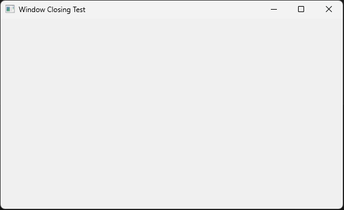](close/README.md)

[**databinding** 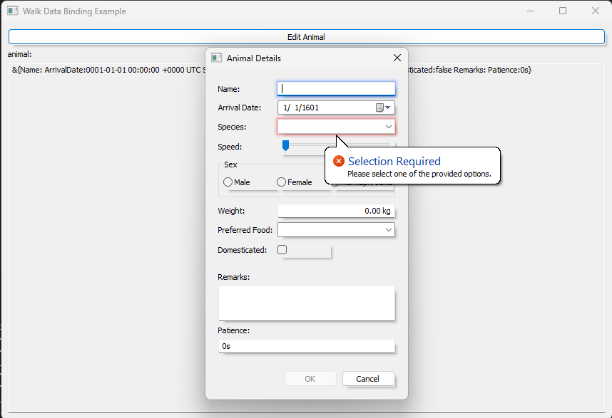](databinding/README.md)

[**drawing** ](drawing/README.md)

[**dropfiles** ](dropfiles/README.md)

[**externalwidgets** 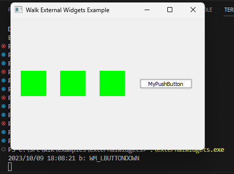](externalwidgets/README.md)

[**filebrowser** 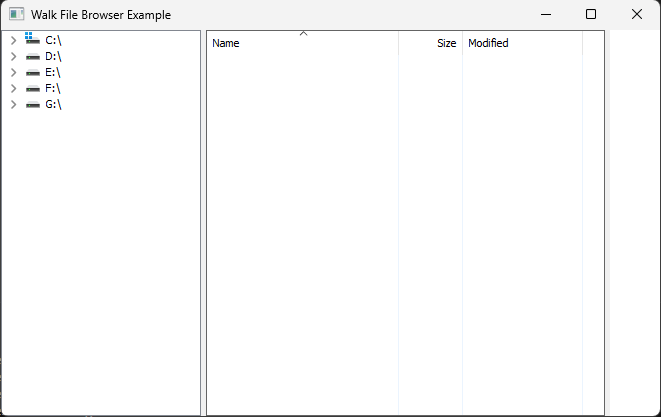](filebrowser/README.md)

[**gradientcomposite** 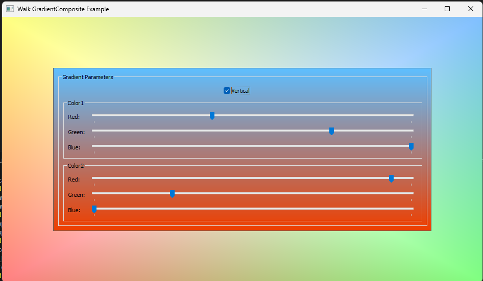](gradientcomposite/README.md)

[**imageicon** 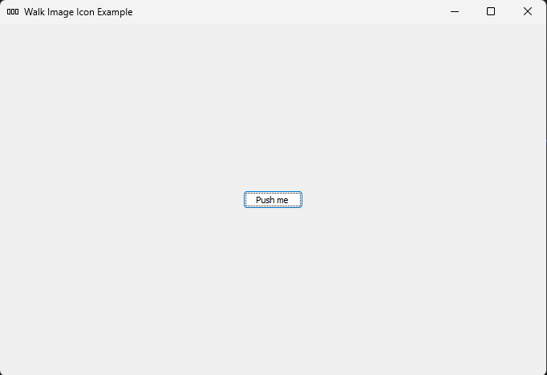](imageicon/README.md)

[**imageview** 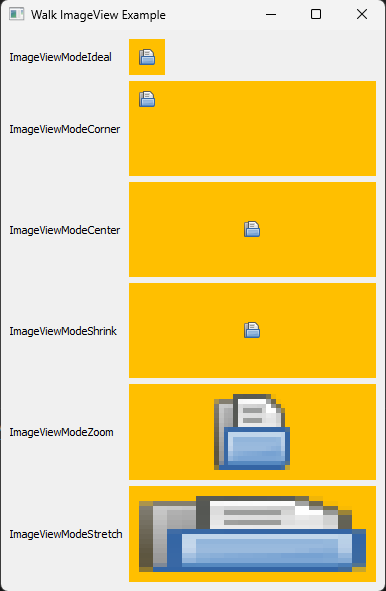](imageview/README.md)

[**imageviewer** 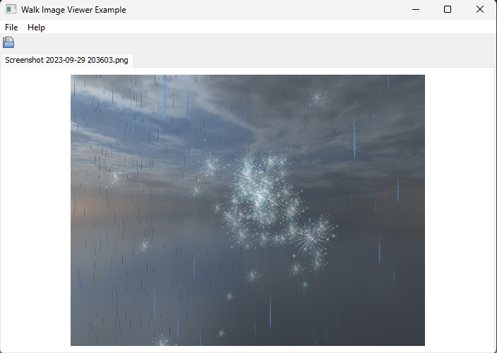](imageviewer/README.md)

[**linklabel** 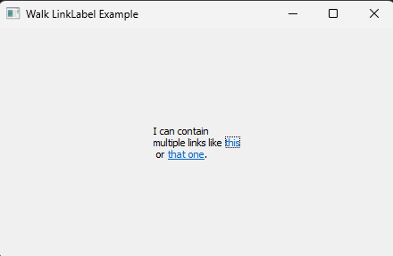](linklabel/README.md)

[**listbox** 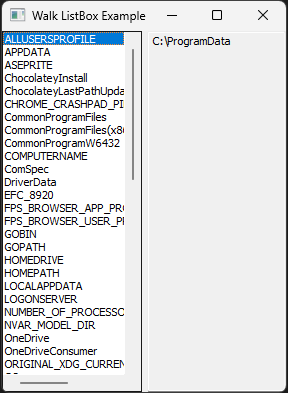](listbox/README.md)

[**listbox_ownerdrawing** ](listbox/README.md)

[**logview** ](logview/README.md)

[**multiplepages** 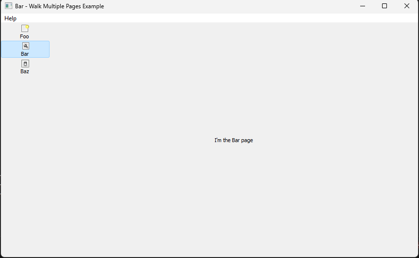](multiplepages/README.md)

[**notifyicon** ](notifyicon/README.md)

[**progressindicator** ](progressindicator/README.md)

[**radiobutton** 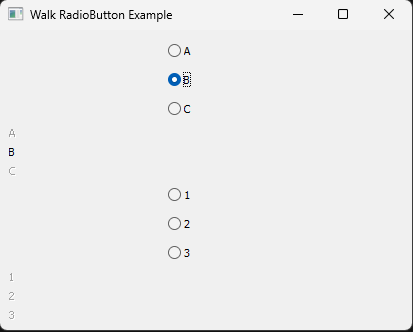](radiobutton/README.md)

[**sink** 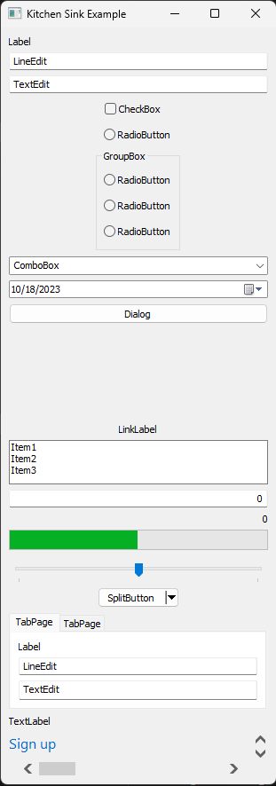](sink/README.md)

[**slider** ](slider/README.md)

[**statusbar** 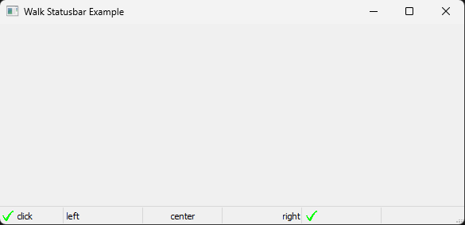](statusbar/README.md)

[**tableview** 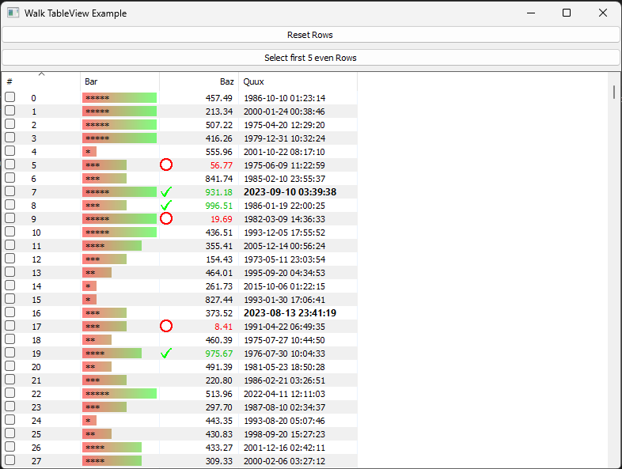](tableview/README.md)

[**taskdialog** 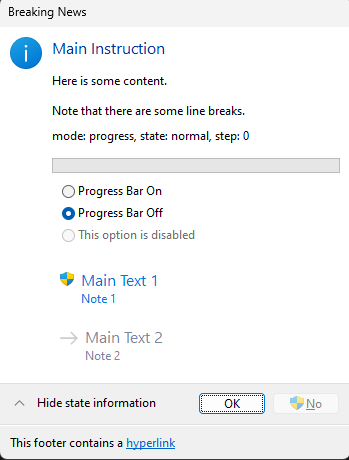](taskdialog/README.md)

[**webview** ](webview/README.md)

[**webview_events** ](webview/README.md)

