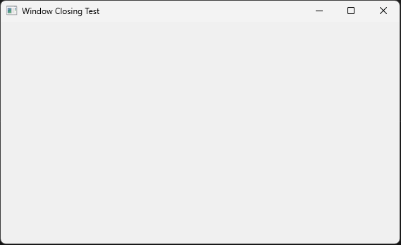

# Close Example

Creates a context with cancellation and captures when a close event occurs on the window.
A <-ctx.Done() listens on a goroutine and does "cleanup", then re-initiates the close. Close then sees the ctx.Err and will exit properly.

This gives you the ability to lock out terminating the window to allow you to shut down dependent services, such as a database, gracefully.

End Task or other forcefull kill methods will still bypass this, but that's expected.